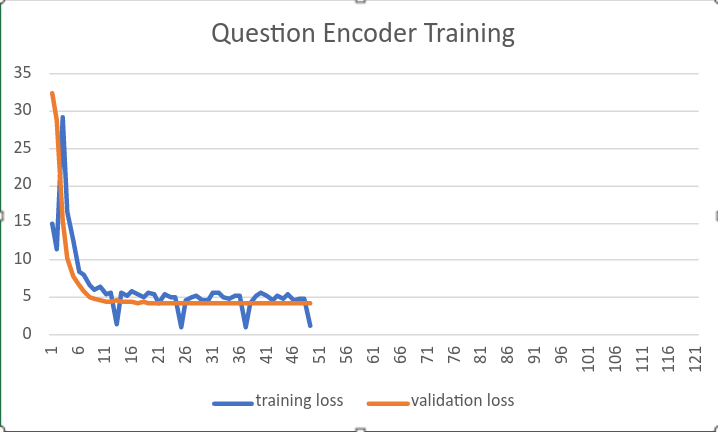

##################
Table of Contents
##################
.. contents::
  :local:
  :depth: 4
  
***************
Model
***************
We will be using BART model.  Given the context and question, it should be able to give us answer.

==============================
BERT - Document encoder
==============================
Used 'bert-base-uncased' as document encoder. All the encodings were saved to a tesor object for later refrence.

==============================
BERT - Question encoder
==============================

.. code-block:: python

 class QuestionEncoder(nn.Module):

    def __init__(self):
        super(QuestionEncoder, self).__init__()
        self.bert = BertModel.from_pretrained('bert-base-uncased')

    def forward(self, x):
        x = self.bert(**x)
        x=x["last_hidden_state"]
        x = x[:,0,:]
        return x
        
------------------------
Dataset
------------------------  

 Set of questions collected.  
 
------------------------
Training/Evaluation
------------------------

        

==============================
FAISS
==============================
------------------------
Dataset
------------------------    
All the document encodings were added to a list.

.. code-block:: python

 de=torch.load('document_enc.pt')

 x=de[0].cpu().detach().numpy()
 t=np.array([x])

 for i in range(1,len(de)):
    x = de[i].cpu().detach().numpy()
    p = np.array([x])
    t= np.append(t, p, axis = 0)
 
 
This list was used to initialize the FAISS model

.. code-block:: python

 index.add(t)
 
 
------------------------
Training/Evaluation
------------------------
Pre-trained model was used.

.. code-block:: python

 d=768
 index=faiss.IndexFlatL2(d)
 
------------------------
Results
------------------------
FAISS test samples output

  =================================================================  =================================================   ======================
  Question                                                             FAISS output                                      Exact document
  =================================================================  =================================================   ======================
  is labelled data needed in  supervised learning?                     [11 22 10 13]                                         22
  does  pytorch uses caching memory allocator?                         [11 10 13 41]                                         41
  How can I learn about Python subprocesses that are still running?    [11 10 41 22]                                         41
  can i use dictionary for padding argument in nn.conv2d function      [11 13  8 28]                                         13
  In Pytorch, which optimizers are supported?                          [10 11 13 22]                                         10
  What's difference between tf.nn.ctc_loss with pytorch.nn.CTCLoss     [11 13 10 25]                                         11
  =================================================================  =================================================   ======================

==============================
BART
==============================

In this project we explain the sequence to sequence modeling using [`HuggingFace <https://huggingface.co/transformers/model_doc/bart.html>`_].

.. code-block:: python

 from transformers import BartTokenizer, BartForConditionalGeneration
 model = BartForConditionalGeneration.from_pretrained('facebook/bart-base')

***************
Dataset Preparation
***************
The dataset should contain input to encoder and decoder.  

==============================
BART encoder input
==============================

This is concatenate text having  1. question  2. Top 3 context found by FAISS.

For the purpose of training teacher forcing was used.  If FAISS model failed to provide  the correct document in top3,  one of document was replaced by correct document.

==============================
BART decoder input
==============================

This the actual answer for the given question as per the document.

